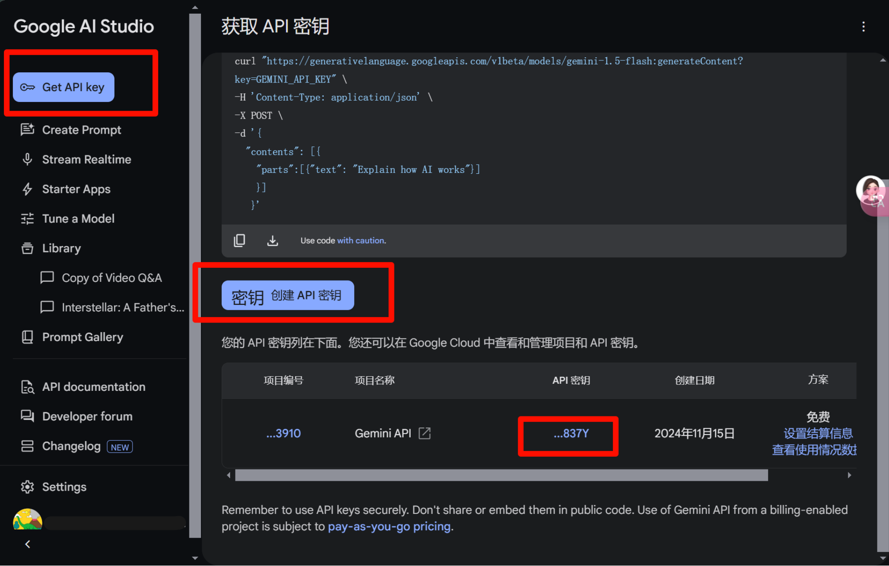

# 视频片段提取工具

[English](README_EN.md) | [中文](README.md)

一个基于 Python + Gemini API + ffmpeg 的视频片段提取工具。

可以根据 Prompt , 提取出视频中符合条件的片段。

修改 Prompt ，可以实现不同的分析提取效果，例如：镜头分析、剧情分析、角色分析等。

示例中实现了比较基础的提取某个角色所有片段的功能。（所以我也把这个工具称为 Fern 提取器 ^ ^）

原理比较简单，就是传入视频，设计 Prompt，得到 json 格式的片段时间线，然后通过 ffmpeg 提取出视频片段。

主要借此机会练习一下接入 LLM API 使用的流程。

Gemini 视频分析功能是通过每秒 1 帧提取图片帧，并以 1Kbps 的速度提取音频，单帧图片输入消耗 258 token，每秒音频输入消耗 32 token，每秒视频内容会变成大约 300 个令牌，这意味着 100 万个 token 的上下文窗口只能容纳略低于一小时的视频内容，参考链接：[Gemini 视觉技术细节](https://ai.google.dev/gemini-api/docs/vision?hl=zh-cn&lang=python#technical-details-video)。

Gemini 的效果目前测试感觉，在分析 2 - 4 分钟的视频时得到的结果比较准确。可以传入比较长的视频，但是我觉得回答的效果差强人意。详情可以参考 [模型测试记录](model_test_record.md)。

## 系统要求
- Windows 10 或更高版本
- Python 3.8+
- FFmpeg
- 需要科学上网

## 安装步骤

### 1. 安装 Python
- 访问 [Python 官网](https://www.python.org/downloads/) 下载并安装 Python
- 安装时请勾选 "Add Python to PATH"

### 2. 安装 FFmpeg
1. 访问 [FFmpeg 官网](https://ffmpeg.org/download.html) 下载 Windows 版本
2. 解压下载的文件
3. 将解压后的 FFmpeg 文件夹中的 bin 目录添加到系统环境变量

### 3. 拉取项目

```
git clone https://github.com/BunnRecord/VideoClipExtractionToolGemini.git
```

### 4. 安装项目依赖
在项目根目录下打开命令提示符（CMD），运行：

```
pip install -r requirements.txt
```

### 5. 获取 API 密钥


1. 访问 [Google AI Studio](https://ai.google.dev/) 并登录 Google 账号
2. 点击左侧菜单栏中的 "Get API key" 按钮
3. 点击 "创建 API 密钥" 按钮获取 API 密钥
4. 将获取的密钥复制出来配置到项目中

注意：请妥善保管 API 密钥，不要在公开代码中暴露

## 使用说明


### 1. 基本操作

1. 打开科学上网。

2. 打开 `7.videoprocess.py` 配置参数  

   GOOGLE_API_KEY（Gemini API密钥）、

   SELECTED_MODEL（选择的 Gemini 模型）、

   SEGMENT_DURATION（分割视频的时间长度）、

   CHARACTER_IMAGE_PATH（角色参考图片地址）、

   CHARACTER_PROMPT（分析角色特征提示词）、

   VIDEO_PROMPT（分析视频内容提示词）、
   
   CLIP_TIME_BUFFER（根据json片段时间线提取视频片段的前后缓冲时间）

3. 命令行输入 `python 7.videoprocess.py` 运行。

4. 在弹出的界面中选择要处理的视频文件。

5. 后续自动执行。

6. 若出错，看在哪一 Part 出错，通过 `6.videoprocess.py` 选择对应Part继续进行分析提取。

### 2. 程序流程

查看程序流程图 [Flowchart.png](Flowchart.png)

### 3. 程序流程说明

#### 3.1 初始化准备

- 配置日志系统
- 设置 Google API 密钥（参考）
- 配置代理
- 创建必要的输出目录

#### 3.2 视频文件选择
- 通过文件选择对话框选择一个或多个视频文件

#### 3.3 将视频分割成多个部分
- 将视频分割成多个部分，每个部分大约 120s 左右（根据 SEGMENT_DURATION 决定 ）。

#### 3.4 角色特征分析
- 上传角色参考图片
- 发送角色特征分析请求
- 获取并保存角色分析结果

#### 3.5 视频处理循环
单个视频的每一部分都会经过以下处理步骤：

1. **视频压缩**
   - 计算目标比特率
   - 压缩视频
   - 保存到 `outputs/{视频名}/compressed/` 目录

2. **视频分析**
   - 上传压缩后的视频
   - 等待处理完成
   - 发送分析请求
   - 获取分析结果

3. **结果保存**
   - 创建分析报告（Markdown格式）
   - 保存到 `outputs/{视频名}/analysis/` 目录

4. **JSON处理**
   - 提取并更新JSON内容
   - 保存到 `outputs/{视频名}/splitjson/` 目录

5. **视频片段提取**
   - 根据分析结果提取视频片段
   - 保存到 `outputs/{视频名}/extract/` 目录

6. **JSON合并**
   - 合并所有JSON文件
   - 保存到 `outputs/{视频名}/mergejson/` 目录

### 4. 输出目录结构
```
outputs/
└── {视频名}/
    ├── compressed/    # 压缩后的视频
    ├── analysis/      # 分析报告
    ├── split/         # 分割后的视频
    ├── splitjson/     # JSON文件
    └── extract/       # 提取的视频片段
```

### 5. 代码目录结构
```
Feilun02/
├── 1.compress.py # 压缩视频
├── 2.split.py # 分割视频
├── 3.gemini_analysis.py # 视频 Gemini 分析（带角色图片特征分析）
├── 3.1gemini_analysis_single_video.py # 视频 Gemini 分析（分析单个视频）
├── 4.extract.py # 根据时间线json提取视频片段
├── 5.mergejson.py # 合并json文件
├── 6.partprocess.py # 分Part单独处理
├── 7.videoprocess.py # 主程序
└── component # API 使用分步脚本
    ├── 3.1test.py # 测试 API 通信
    ├── ...
    ├── 3.9gemini_video_chatsession_struct.py # Gemini 视频分析结构化输出
    ├── 3.11gemini_multi_model.py # Gemini 多模态视频分析界面
    └── 3.12gemini_multi_nointerface.py # Gemini 多模态视频分析
```

## 使用建议

Pro 模型对视频的描述会比 Flash 模型详细一些，但速度会慢一些，如果对视频描述要求不高，可以考虑使用 Flash 模型。

Flash 会有小概率丢片段的情况，大多数时间效果还是不错的。

详情可以参考 [模型测试记录](model_test_record.md)。

另外，Google 官网目前（2025-01-05）给的免费额度，Pro 每天免费提问 50次，而 Flash 每天免费提问 1500 次。

Flash 的费用也比 Pro 大大降低。

具体可以参考 Gemini 的 [定价页面](https://ai.google.dev/pricing)。

```

Gemini 1.5 Flash

输入价格 0.075 美元 / 100 万个令牌

输出价格 0.30 美元 / 100 万个令牌

上下文缓存 0.01875 美元 / 100 万个令牌

```

一个 180s 的视频，大概需要消耗 5w token，所以使用 Gemini 1.5 Flash 分析 60 分钟的视频花费人民币 0.5 元左右。

```

Gemini 1.5 Pro

输入价格 12.5 美元 / 100 万个令牌

输出价格 50.00 美元 / 100 万个令牌

上下文缓存 0.3125 美元 / 百万令牌

```

一个 180s 的视频，大概需要消耗 5w token，所以使用 Gemini 1.5 Pro 分析 60 分钟的视频花费人民币 87.5 元左右。

Pro 的分析效果比 Flash 好一些，但花费是高很多的，不过模型费率过一段时间就会降很多，Gemini 2.0 的模型也快正式上线了，后续还是值得期待的。

## Gemini 参考链接

- 在线使用Gemini ：[Google AI Studio](https://aistudio.google.com/prompts/new_chat)

- [Gemini API 参考文档](https://ai.google.dev/gemini-api/docs?hl=zh-cn)

- [Gemini API 价格](https://ai.google.dev/pricing)

- [Gemini 2.0 官方介绍](https://ai.google.dev/pricing)

## 常见问题
1. 如果提示 "ffmpeg 不是内部或外部命令"，请检查 FFmpeg 是否正确添加到环境变量
2. 如果提示缺少依赖，请确认是否正确执行了 `pip install -r requirements.txt`

## 注意事项
- 首次使用前请确保完成所有安装步骤
- 处理大文件时可能需要较长时间，请耐心等待
- 每个视频处理完成后会等待5秒再处理下一个，以避免 API 限制
- 所有处理日志都会保存在 `log/batch_Process.log` 文件中

## 技术支持
如遇到问题，请提交 Issue 或联系开发者，邮箱：ghosting0942@gmail.com。